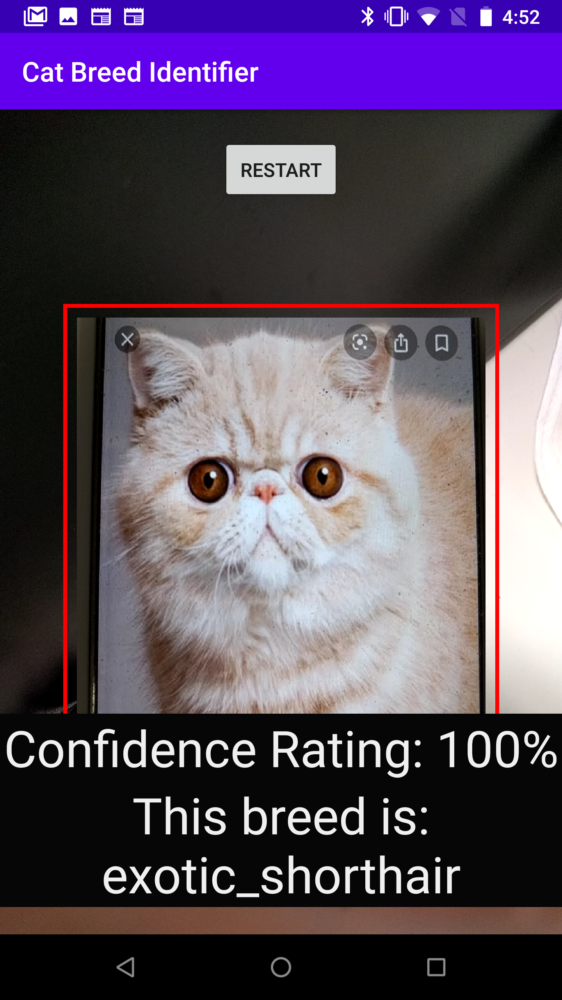
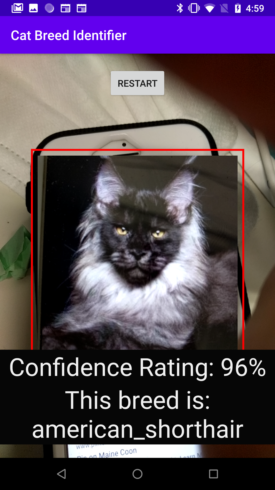

# Cat Breed Identifier App
Android app for identifying the breed of the cat

Status: Usable but needs improvement for accuracy

## How to use:
Download android-app directory, and open in Android-Studio. Build and run on an Android phone.

### Notes:
Dataset is from [Oxford's pet dataset](https://www.robots.ox.ac.uk/~vgg/data/pets/). However, it is missing many of the popular breeds, so I scraped some images from Google and Pinterest to make the datasets for other classes of cats. 

### Issues:
As can be seen in images like

it often sees many cats as American shorthairs, unless they're distinctive like the Sphnynx cat. Currently improving the model. 
